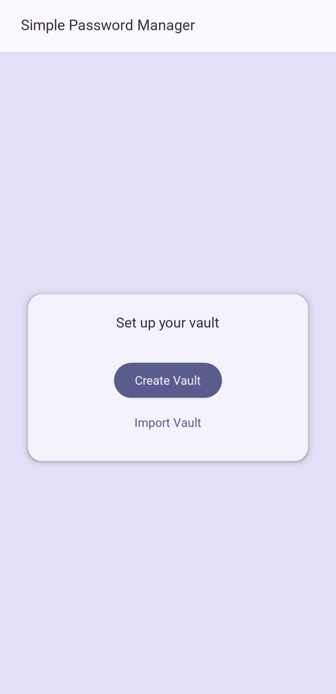
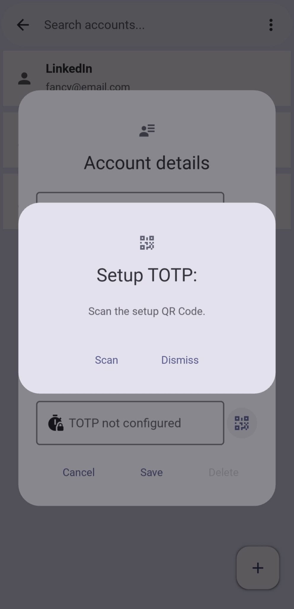
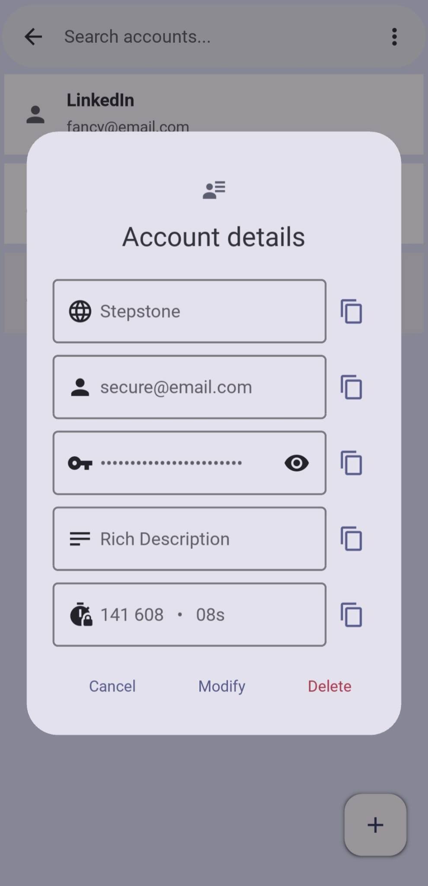
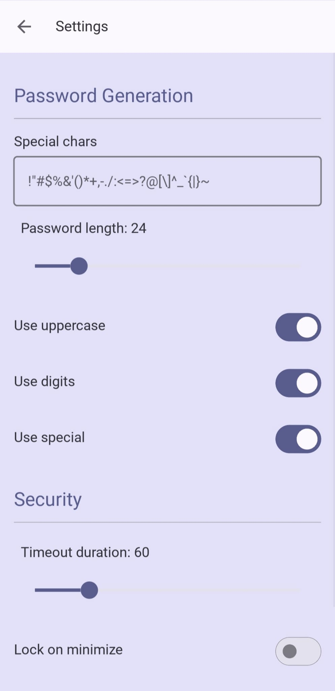

# Simple Password Manager

A local password manager written in Python with two frontends: a **Kivy/KivyMD graphical interface** for desktop and Android, and a **terminal interface** for command-line use.

Vault data remains local and is protected using Argon2id-derived keys and authenticated encryption.

## App Preview

<p align="center">
  
  
  
</p>

<p align="center">
  
  
  
</p>

<p align="center">
  
  
</p>

## Features

* Local encrypted vault protected by a master password
* Account creation, modification, deletion, search and clipboard actions
* Configurable password generation and TOTP support, including QR-code setup
* Vault creation, import, export and master-password changes
* Configurable inactivity locking, lock-on-minimize behavior and light/dark theme
* Desktop/Android GUI and a full CLI built on the same backend

## Design

The project separates presentation from application logic. The `gui/` and `cli/` packages are independent frontends built around the same `core/` implementation and vault format, while filesystem and QR-code helpers live in `storage/`.

A `VaultSession` coordinates key derivation, vault loading and persistence. The master password is processed with **Argon2id**, then purpose-specific subkeys are derived for vault encryption and settings authentication. Vault contents use **AES-GCM**, while settings are authenticated with **HMAC**.

Vault updates use temporary files followed by atomic replacement. The GUI performs vault synchronization outside the main UI thread and includes inactivity locking to reduce the time an unlocked vault remains accessible.

## Graphical Interface

Launching the application without arguments starts the GUI:

```bash
python main.py
```

On first launch, the user can create a new vault or import an existing one. Once a vault exists, the application opens into the unlock flow.

The GUI provides account management and search, password generation, clipboard actions, TOTP setup and display, vault import/export, settings, and automatic locking.

## Command-Line Interface

Passing a vault path starts the terminal interface:

```bash
python main.py my.vault
```

A new vault can be created with:

```bash
python main.py my.vault --create
```

The CLI exposes the same core vault functionality through a terminal interface, including account management, search, password generation, TOTP, settings, master-password changes, saving and inactivity locking.

## Project Structure

```text
simple_password_manager/
├── main.py                  # Selects GUI or CLI
├── core/                    # Password manager, crypto, settings and vault session
├── storage/                 # Filesystem, constants and QR-code helpers
├── cli/                     # Terminal frontend
├── gui/                     # Kivy/KivyMD frontend
├── docs/
│   └── screenshots/
├── requirements.txt
├── APK_Build_README.md
└── LICENSE
```

## Security Design

The master password itself is never stored.

Argon2id derives the master key using a per-vault salt. Separate subkeys are then used for vault encryption and settings authentication. Vault contents are encrypted and authenticated with AES-GCM using a 256-bit key and a fresh nonce for each encryption operation.

Settings are stored alongside the encrypted vault data and authenticated with HMAC so modification can be detected before the settings are trusted.

Passwords, derived keys and TOTP secrets still exist in process memory while a vault is unlocked. Copied values may also remain in the system clipboard or clipboard history.

## Technology

The project uses Python 3.13, Kivy 2.3.1, KivyMD 2.0.0, `cryptography`, `argon2-cffi`, PyOTP, ZXing-C++, `prompt-toolkit`, Buildozer and python-for-android.

The Android build process has been tested with Python 3.13.15.

## Running from Source

Python **3.13** is required.

Create and activate a virtual environment:

```bash
python -m venv .venv

# Linux
source .venv/bin/activate

# Windows PowerShell
.venv\Scripts\Activate.ps1
```

Install the dependencies:

```bash
pip install -r requirements.txt
```

Start the GUI:

```bash
python main.py
```

Or start the CLI with a vault file:

```bash
python main.py my.vault
```

### Linux Clipboard Support

Clipboard operations use `pyperclip`. On Linux, `xclip` may additionally be required:

```bash
sudo apt install xclip
```

## Android Build

The application can be packaged for Android using Buildozer and python-for-android.

The complete Android setup, known issues and workarounds are documented in `APK_Build_README.md`.

## Security Notice

This is a personal software and security project and has **not undergone a professional security audit**.

It should therefore not be relied upon as a production password manager or as the only storage location for important credentials.

## Current Limitations

There is currently no browser integration or autofill, automatic clipboard clearing, cross-device synchronization, or formal security audit.

## License

The source code is licensed under the **MIT License**. See `LICENSE`.

Third-party assets are licensed separately and are not automatically covered by the project's MIT License. See `assets/ATTRIBUTION.md` for attribution and licensing information for the application icon.

## About the Project

This project was developed as a practical software-engineering and security project, with a focus on application architecture, applied cryptography, concurrent tasks, UI responsiveness and cross-platform Python development.

The application code in this repository was written by the author. The automated test suite was initially generated with assistance from an AI agent and subsequently reviewed and adapted to the project's implementation.
