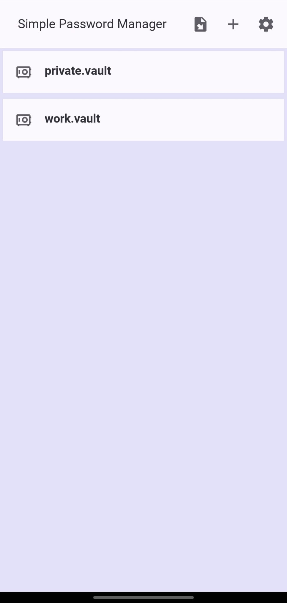
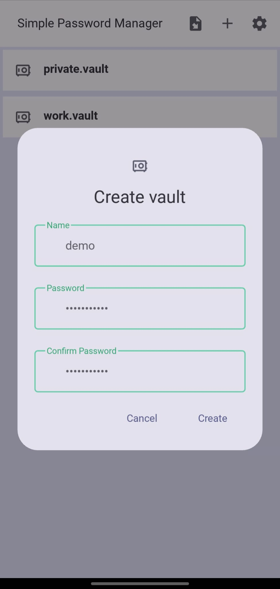
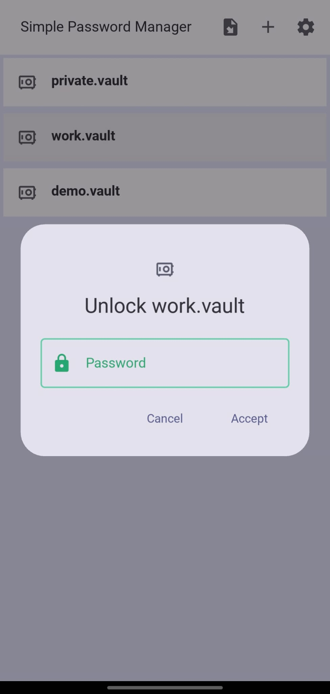
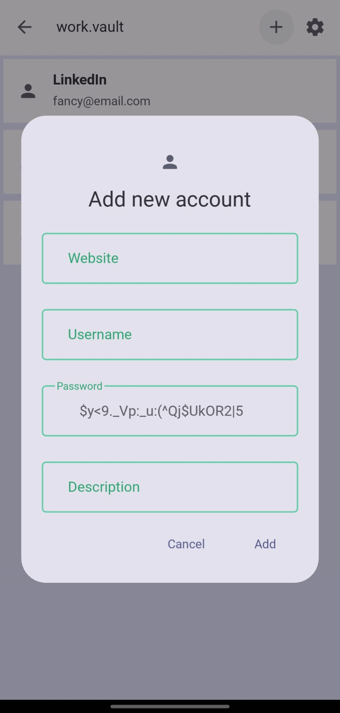
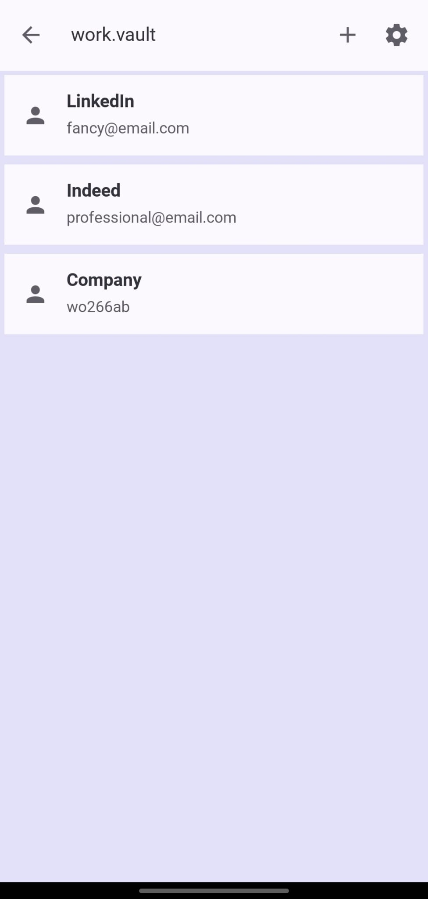
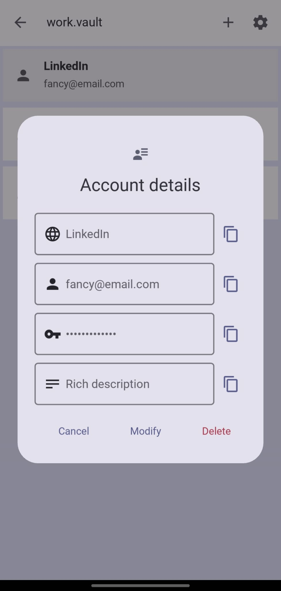

# Simple Password Manager

A local password manager written in Python with two frontends: a **Kivy/KivyMD graphical interface** for desktop and Android, and a **terminal interface** for command-line use.

## App Preview

<p align="center">
  
  
  
</p>

<p align="center">
  
  
  
</p>

## Features

* Local encrypted `.vault` files protected by a master password
* Create, import and manage multiple vaults
* Add, modify and delete account entries
* Copy account information directly from the GUI
* Password generation
* Account entry search **(currently CLI-only)**
* Inactivity watchdog **(currently CLI-only)**
* TOTP / two-factor authentication support  **(currently CLI-only)**
* **Argon2id** key derivation
* **AES-GCM** authenticated encryption
* Atomic vault writes
* Graphical interface using **Kivy / KivyMD**
* Full command-line interface
* Android support

## Two Interfaces, One Core

Both interfaces use the same underlying password-management, cryptography and storage code.

### Graphical Interface

Launching the application without arguments starts the GUI:

```bash
python main.py
```

The GUI supports:

* Vault selection
* Vault creation and import
* Master-password authentication
* Account creation, modification and deletion
* Account detail views
* Clipboard actions

The GUI also includes some responsiveness-oriented implementation details: account entries are loaded in batches rather than all at once, and vault changes are encrypted and synchronized outside the main UI thread.

### Command-Line Interface

Passing a vault path starts the original terminal interface:

```bash
python main.py my.vault
```

A new vault can be created with:

```bash
python main.py my.vault --create
```

The CLI provides entry management, searching, password generation, TOTP retrieval, clipboard support, manual saving and an inactivity watchdog.

## Project Structure

```text
simple_password_manager/
├── main.py                  # Selects GUI or CLI
│
├── core/                    # Interface-independent application logic
│   ├── encrypt.py           # AES-GCM encryption/decryption
│   ├── entry.py             # Password-entry model
│   ├── errors.py            # Application-specific exceptions/logging
│   ├── keys.py              # Argon2id key derivation
│   ├── pwd_manager.py       # Vault and entry management
│   └── totp.py              # TOTP parsing and generation
│
├── storage/
│   └── io.py                # Vault filesystem operations
│
├── cli/                     # Terminal frontend
│   ├── main.py
│   ├── actions.py
│   ├── display.py
│   ├── input.py
│   ├── util.py
│   └── watchdog.py
│
├── gui/                     # Kivy/KivyMD frontend
│   ├── main.py
│   ├── screens/             # Application screens and navigation
│   ├── dialogs/             # Vault/account dialogs
│   ├── widgets/             # Reusable UI components
│   ├── utils/               # GUI-specific helpers
│   └── design/              # UI design resources
│
├── requirements.txt
└── APK_Build_README.md
```

The main architectural goal is to keep **presentation separate from application logic**.

The `gui/` and `cli/` packages are two independent frontends built around the same `core/` password manager and encrypted vault format. Filesystem-related operations are kept in the `storage/` layer.

## Security Design

The master password itself is never stored.

Instead, it is used with **Argon2id** to derive a 256-bit encryption key. Vault contents are encrypted and authenticated using **AES-GCM**.

An encrypted vault contains the salt, nonce, ciphertext and associated data required for decryption.

Each encryption operation generates a fresh nonce.

Vault updates use a temporary file followed by an atomic replacement of the previous vault. This reduces the chance of destroying an existing vault if a write fails partway through.

Passwords and TOTP secrets still exist in process memory while an unlocked vault is being used, and copied values may remain in the system clipboard or clipboard history.

## Technology

* Python 3
* Kivy 2.3.1
* KivyMD 2.0.0
* cryptography
* Argon2
* PyOTP
* Buildozer / python-for-android

The Android build process has been tested with Python 3.13.15.

## Running from Source

Python **3.13** is required.

Create and activate a virtual environment:

```bash
python -m venv .venv

# Linux
source .venv/bin/activate

# Windows PowerShell
.venv\Scripts\Activate.ps1
```

Install the dependencies:

```bash
pip install -r requirements.txt
```

Start the GUI:

```bash
python main.py
```

Or start the CLI with a vault file:

```bash
python main.py my.vault
```

### Linux Clipboard Support

Clipboard operations use `pyperclip`. On Linux, `xclip` may additionally be required:

```bash
sudo apt install xclip
```

## Android Build

The application can be packaged for Android using Buildozer and python-for-android.

Because some native dependencies require additional Android build configuration, the complete setup, known issues and workarounds are documented separately in:

`APK_Build_README.md`

## Security Notice

This is a personal software and security project and has **not undergone a professional security audit**.

It should therefore not be relied upon as a production password manager or as the only storage location for important credentials.

## Current Limitations

* No browser integration or autofill
* No automatic clipboard clearing
* No cross-device synchronization
* No formal security audit

## About the Project

This project was developed to gain practical experience with:

* Object-oriented programming
* Structured programming
* Application architecture and separation of concerns
* Multithreading and concurrent tasks
* UI responsiveness
* Cross-platform Python development

The application code in this repository was written by the author. The automated test suite available on a separate testing branch was initially generated with assistance from an AI agent and subsequently reviewed and adapted to the project's implementation.
